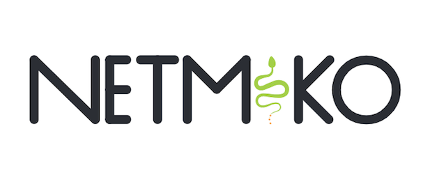

# Async Netmiko Test

## IaC - Infraestructure as Code

It refers to the practice of managing and provisioning computing infrastructure (such as servers, networks, and databases) through code and automation rather than through manual processes. This allows infrastructure to be treated the same way as application code, enabling it to be versioned, tested, and deployed using software development practices.

### Network Automation

As part of IaC, Network Automation refers to the use of software to automatically manage, configure, test, deploy, and operate network devices and services. It replaces manual tasks with programmatic workflows and scripts, reducing human intervention, minimizing errors, and increasing efficiency in network management.

This approach is increasingly important in modern networking, especially in large-scale environments such as cloud infrastructures, data centers, and enterprise networks.

### Async Netmiko

Async Netmiko is a repository that contains tests I have conducted to differentiate the performance between running Netmiko synchronously versus asynchronously.

The outputs directory contains the results of each test, and as can be observed, the results are notably different.

To conduct the test, I utilized the EVE-NG Pro simulator hosted on Google Cloud, setting up a lab environment with five Cisco IOS devices.

#### Sync, Async Multi-Thread and Non-Blocking Async

- Sync Mode: Tasks are executed sequentially, one after the other. Each task must complete before the next one starts. The program waits for a task to finish before moving on.
- Async Multi-Thread Mode: Involves creating multiple threads within a process. Threads can run concurrently, sharing memory and resources. Python threads are managed by the OS, but the GIL (Global Interpreter Lock) restricts true parallel execution of Python in a single process at a time.
- Non-Blocking Async Mode: Uses an event loop to manage tasks cooperatively in a single thread. Tasks voluntarily yield control using await during I/O or other non-blocking operations. No threads are created; instead, the event loop interleaves tasks during await points and GIL is not an issue.
- Python 3.12 has improved performance for the GIL and threading, but the fundamental limitations of the GIL remain.

### Running as script

Note: To connect to the devices, I configured SSH Bastion Host on my Mac.

From your CLI execute the following:

- `python3 sync_serv.py` demonstrates synchronous operations.
- `python3 async_serv.py` demonstrates asynchronous multi-thread operations.
- `python3 nb_async_serv.py` demonstrates non-blocking asynchronous operations.

#### SSH JumpHost configuration

SSH Configuration file for netmiko & bastion host

host jumphost  
  IdentityFile ~/.ssh/id_rsa  
  IdentitiesOnly yes  
  user xxxx  
  hostname xxxx.octupus.com  

host 10.2.0.* !jumphost  
  ProxyCommand ssh -F ~/.ssh/config -W %h:%p jumphost  

host 10.2.0.*  
  KexAlgorithms +diffie-hellman-group1-sha1  
  Ciphers aes128-ctr,aes192-ctr,aes256-ctr,aes128-cbc,3des-cbc  
  HostKeyAlgorithms=+ssh-dss  

### Running as an API endpoint

I configured a FastAPI project with two endpoints:

- `/api/v1/netmiko/async` demonstrates asynchronous multi-thread operations.
- `/api/v1/netmiko/nb-async` demonstrates non-blocking asynchronous operations.
- `/api/v1/netmiko/sync` demonstrates synchronous operations.

To launch the application, execute the following command in your CLI:

- `uvicorn controller:app --reload`
- `localhost:8000/docs`

This project demonstrates how to integrate asynchronous Netmiko operations within an HTTP server using FastAPI. The uvicorn server is utilized as it supports both synchronous and asynchronous programming, showcasing FastAPI’s flexibility for network automation tasks.

### Results

#### Test time for five devices and two commands per device

Sync netmiko: {'result': 'Tiempo total: 0:00:30.678405'}  
Async Multi-Thread netmiko: {'result': 'Tiempo total: 0:00:07.157979'}  
Non-Blocking Async netmiko:{'result': 'Tiempo total: 0:00:10.126575'}

Hope this helps in your automation journey  

Ed Scrimaglia
  